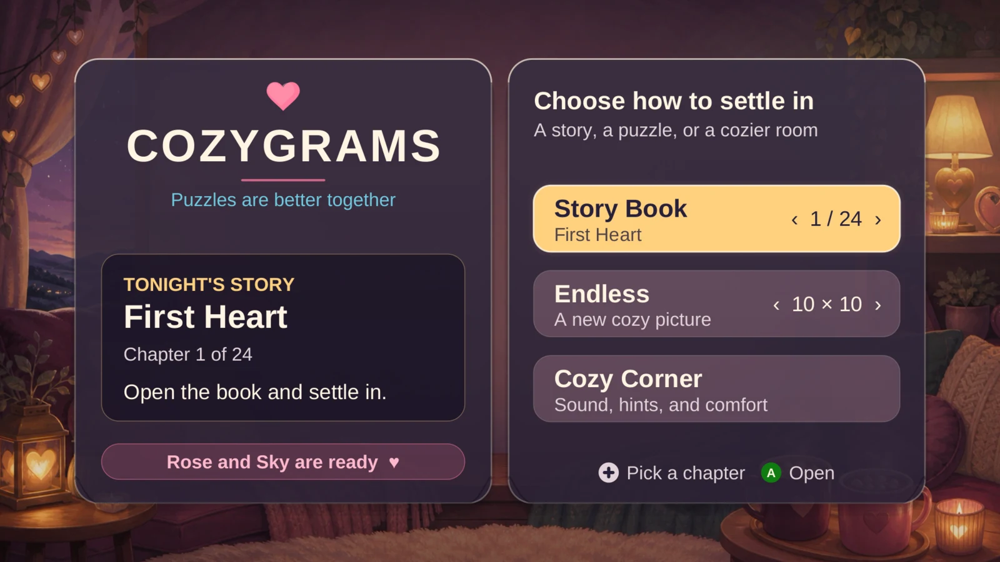
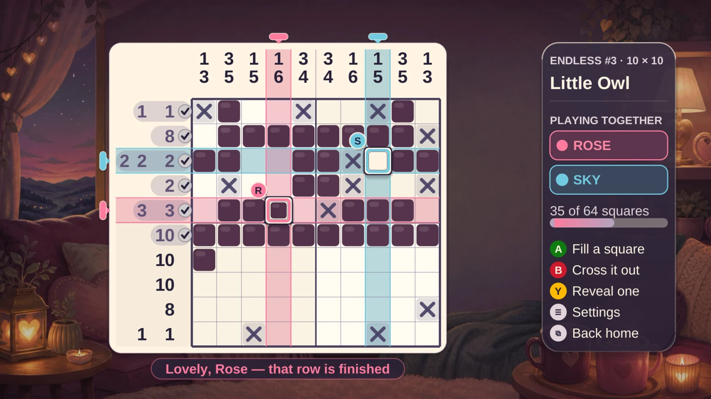
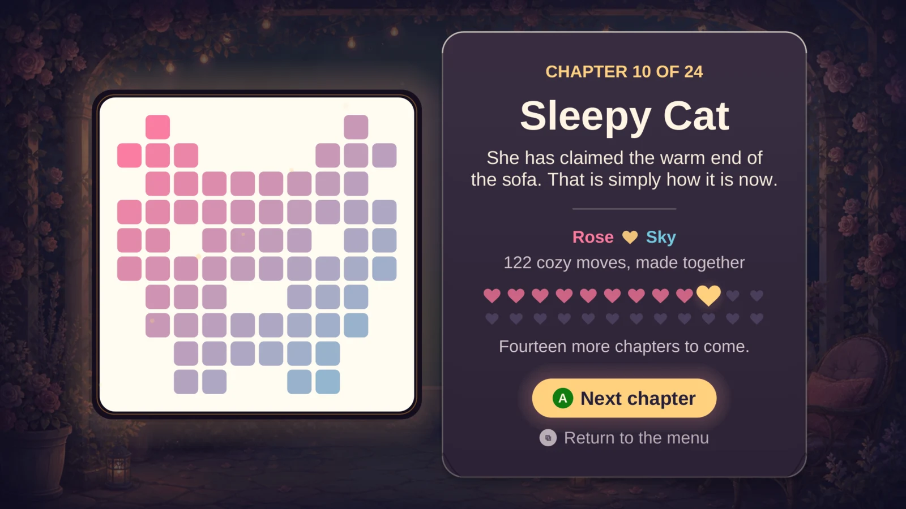

# CozyGrams for Android TV

A cozy, endless nonogram game made for the couch. Play solo, or hand someone a second
controller and solve every picture together with independent Rose and Sky cursors.



## Made for a cozy evening together

CozyGrams pairs a warm, television-first interface with true local co-op: each controller
keeps its own player, cursor and colour while both players solve one shared picture. The
Story Book turns each finished puzzle into a little keepsake and remembers which chapters
you have completed.

| Solve together | Finish a chapter |
|---|---|
|  |  |

## Controls

| | gamepad | bare TV remote |
|---|---|---|
| move | D-pad or left stick (wraps around) | D-pad |
| fill a square | **A** | **OK** cycles fill → cross → clear |
| cross a square out | **B** or **X** | (part of the OK cycle) |
| reveal one square | **Y** | hold **OK** |
| cozy corner | **Menu** / **Start** | **Menu** |
| back | **B** in menus, **Back** | **Back** |

A remote has no face buttons, so the centre key does more work there and the on-screen
legend changes to match whatever is actually in the room. The first controller to send
input becomes Rose, the second becomes Sky, and both keep their identity for the session —
including across a controller falling asleep and waking up with a new device id.

## Game features

- **Every board is uniquely line-solvable.** A real constraint solver checks each puzzle,
  so the clues alone are always enough — you never have to guess, and there is never a
  second valid answer to feel cheated by. All 4,608 boards the endless deck can deal and
  all 24 Story Book chapters are checked on every test run.
- A deterministic Endless deck rather than baked pictures followed by random noise: 24
  named subjects (hearts, sleepy cats, cocoa, moons, rain on the window, teapots, mittens,
  sleeping foxes, pie…) are each drawn in 12 silhouette-changing looks at every supported
  size. Finishing a picture advances the seeded deck; its title names the subject family.
- **Bigger boards are bigger puzzles.** Subjects are drawn with holes rather than filled
  in — a handle to hook a finger through, two slats of pastry, the middle lifted out of a
  heart — so a 20×20 line averages two clue groups instead of one long run, no row or
  column is ever completely blank, and the first sweep of the clues gives away 59% of the
  grid instead of 69%.
- A 24-chapter handcrafted Story Book with a real size ladder: four 5×5 evenings, three
  7×7, six 10×10, four 12×12, five 15×15 and two 20×20 to finish on. Every chapter is its
  own picture rather than one the endless deck also deals, carries a line of its own, and
  asks at least one question the first sweep of the clues cannot answer.
- Local couch co-op with two independent cursors, shared credit and no scoreboard.
- Runtime-synthesized score — a 3½-minute evolving music box in F pentatonic with five
  layers that fade between sections, plus ten distinctly-synthesized sound effects and a
  12-voice mixer so both players are always heard.
- Illustrated living-room and moonlit-garden scenes that stay visible while you play.
- Comfort options: larger text, extra contrast, colour-blind-friendly player identity,
  bolder cursors, calmer animation, gentle mistake checking, and put-everything-back.
- Progress that survives anything — a versioned save with a fingerprint of the hidden
  picture, so a stale or mismatched save deals a fresh board instead of corrupting one.
- Native landscape TV interface. No touchscreen required, nothing below the safe area.

## Build and test

Install JDK 17 and the Android SDK, then run:

```sh
./gradlew test lint assembleDebug
```

The debug APK is at `app/build/outputs/apk/debug/app-debug.apk`. GitHub Actions runs
tests, lint and a complete debug build on every push and pull request.

## Previewing the interface without a device

The entire UI is drawn onto one `Canvas`, and the rendering code is deliberately free of
`View`, `Context` and input handling. That makes it possible to render real frames on a
desktop JVM, with no emulator:

```sh
tools/preview/render.sh [outputDir] [width] [height]     # 26 scenarios, default 1920x1080
```

It compiles a Java2D-backed set of `android.graphics` stubs together with the app's own
rendering sources and writes deterministic PNGs — the same input always produces the same
bytes, so frames can be compared across changes. `tools/legacy-preview/render-legacy.sh`
does the same for the pre-2.0 interface, for side-by-side comparison.

The set covers both menus, the board at every size it deals, an authored story chapter, a
solo table and a two-player one, the feedback a press produces, the win card early and
settled, the page turn between chapters, and the layout cases that break things — the
widest message, Larger Text, Extra Contrast, and one title screen carrying every long
string at once. Twenty-three of them render at whatever resolution you ask for; `sizes/`
holds the same 20×20 board pinned at 1280×720 and 3840×2160, so a scaling regression turns
up as a picture rather than as an argument.

Nothing in the set is posed. The frames that show the game reacting — the particles, the
win — press the button and let the same calls the real input path makes decide what comes
out, because a harness that emits its own prettier confetti is a harness that gets
reviewed instead of the game.

**These frames outlive the tree they came from.** `tools/preview/out/` is in `.gitignore`,
so nothing in the repository records how old a copy of one is, and a set rendered before
v2.0.0 once survived long enough to have a review written from it. Every frame therefore
carries the short commit and a fingerprint of the compiled sources in its bottom-left
corner, outside the safe area, where it can cover backdrop and nothing else; if that
disagrees with `git log -1`, the picture is old. Alongside them, `MANIFEST.sha256` lists
every input and every output, so

```sh
sha256sum -c tools/preview/out/MANIFEST.sha256    # from the repository root
```

names the file that has moved — a source means the frames are stale, a PNG means one has
been edited. The date lives there and in `out/README.md` rather than in a pixel, so that
two renders of one tree stay byte-identical.

Half of a cozy interface is its timing, and a still frame cannot show that. The companion
script records the same renderer in motion:

```sh
tools/preview/record.sh [outputDir] [width] [height] [fps] [clip]   # 8 clips, default 30 fps
```

Each clip opens on a settled state and then replays a script of controller presses through
the same calls the real input path makes — a cursor walk, a run of fills, crossing out and
taking it back, the wave down a completed line, a hint, gentle mode's soft correction, the
last square of a picture through to the settled win card, and the home menu's focus. The
clock is wound forward sixty steps a second whatever the capture rate is, because that is
the rate a television redraws at and a clip should be a recording rather than a
reconstruction.

Every clip is written three ways into the output directory: `<clip>.mp4` to judge the
timing by, `<clip>.gif` to glance at, and `<clip>-contact.png`, a contact sheet tiling
eight evenly spaced frames with their millisecond offsets burned in — that last one is
what a review actually reads, and it carries the same commit and fingerprint in its
header. `ffmpeg` is the only extra dependency, `COZY_KEEP_FRAMES=1` keeps the PNG
sequences it encodes from, and passing a clip name records just that one.

## Release

Every push to `main` is tested and built into a release APK automatically. Releases use
date-based versions such as `v2026.09.04.42`, where the final number is the GitHub Actions
run number. After publishing, the workflow removes older GitHub Releases so only the
latest release remains. It contains `CozyGrams-latest.apk` and its SHA-256 checksum. The
APK is suitable for sideloading on NVIDIA Shield TV Pro (enable installation from unknown
sources first).

Release APKs use the project's stable sideloading certificate, so subsequent GitHub
Releases install as in-place upgrades. The bundled certificate is intentionally for this
open-source personal game — not for Play Store identity or security-sensitive
distribution.
