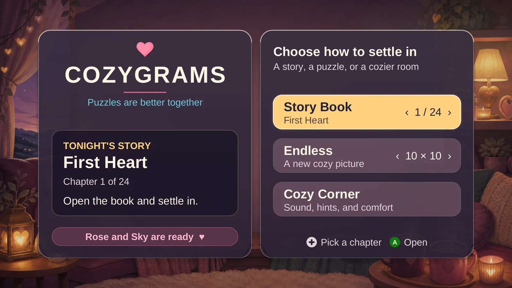
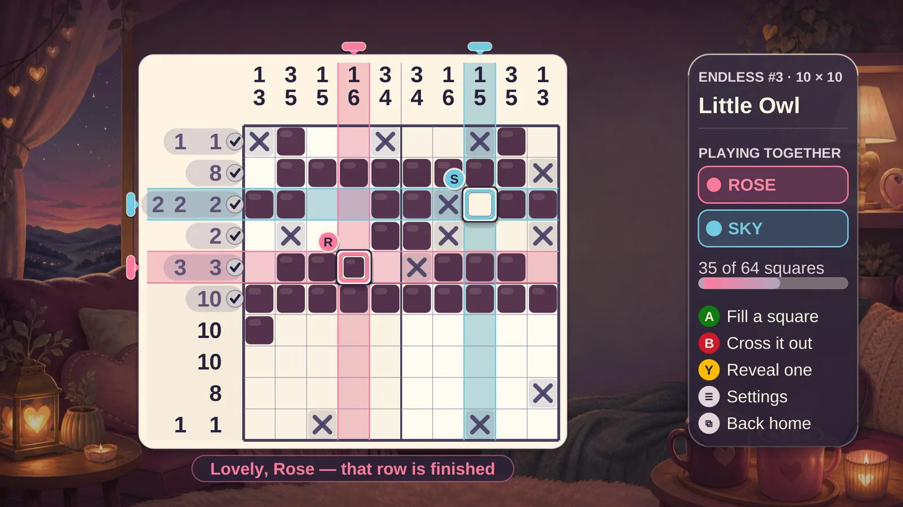
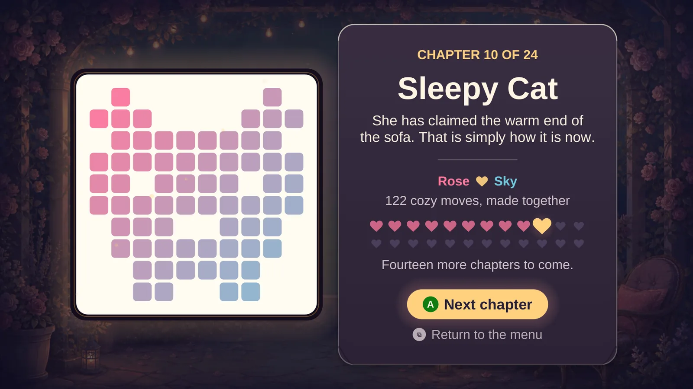
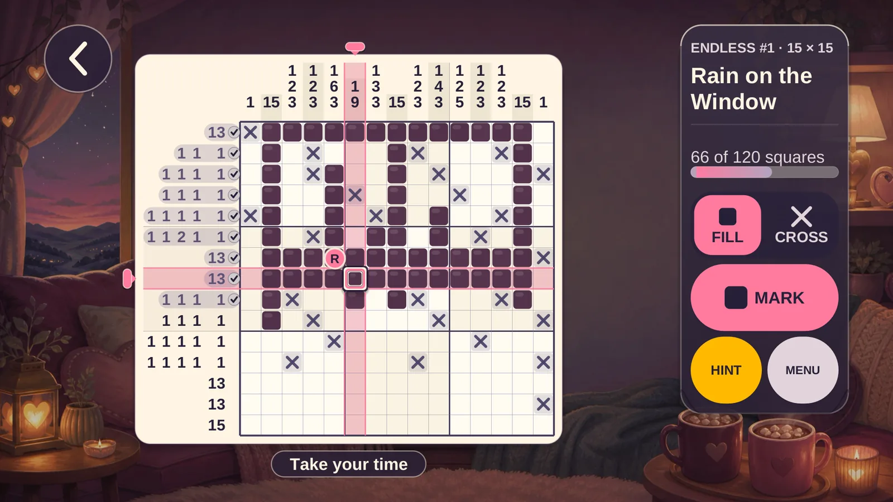

# CozyGrams

A cozy, endless nonogram game made for the couch. Play solo, or hand someone a second
controller and solve every picture together with independent Rose and Sky cursors. One
app for Android TV and for phones and tablets: a television gets the ten-foot interface
and controllers, a phone gets the same game as a one-player touch puzzle with a fill-or-cross pen.



## Made for a cozy evening together

CozyGrams pairs a warm, television-first interface with true local co-op: each controller
keeps its own player, cursor and colour while both players solve one shared picture. The
Story Book turns each finished puzzle into a little keepsake and remembers which chapters
you have completed.

| Solve together | Finish a chapter |
|---|---|
|  |  |

## Controls

| | gamepad | bare TV remote |
|---|---|---|
| move | D-pad or left stick — hold to keep travelling (wraps around) | D-pad — hold to keep travelling |
| fill a square | **A** | **OK** cycles fill → cross → clear |
| cross a square out | **B** or **X** | (part of the OK cycle) |
| reveal one square | **Y** | hold **OK** |
| cozy corner | **Menu** / **Start** | **Menu** |
| back | **B** in menus, **Back** | **Back** |

A remote has no face buttons, so the centre key does more work there and the on-screen
legend changes to match whatever is actually in the room.

### Learning the game

A first evening opens on a short **guided tour** that solves a real 5×5 heart
with you: it reads a clue and fills the row it gives away, hands you one square
to fill and one to cross out with whatever is in your hands (A and B on a
gamepad, OK on a bare remote, a tap and a hold on a touch screen), shows the
finished picture, then the controls, how a second controller joins as Sky, and
where to go next. **Skip tour**, **Back** and **Next** are reached with left and
right; Back or Menu leaves at any step. After it, **one-time tips** point at the
Story Book row, the Cozy Corner, the clues, the pen and HINT the first time you
meet them, and go away with your next press.

**How to play**, in the Cozy Corner, has five pages — the basics, the controls
(for whatever is in the room), playing together as Rose and Sky, the Story Book
and Endless, and common questions — turned with left and right or by tapping a
tab, and takes the tour again. Screenshot and test runs skip the tour and the
tips with a launch extra:

```sh
adb shell am start -n com.cozygrams.tv/.MainActivity --ez skip_welcome true
```

A keyboard plays too — arrows or **WASD** to move, **Enter** or **Space** to fill, **X** or
**C** to cross out, **H** for a hint, **M** or **Tab** for the cozy corner and **Esc** to go
back — and a mouse's right button crosses out the square under the pointer.

### On a phone or tablet

A phone or tablet starts as a one-player game: no Sky, no second cursor, no "press a button
to join". **Two players** in the Cozy Corner opens Sky's seat for a controller paired to the
device (and turns it off again on a television, where it starts on). Rose is the finger on
the glass.



The rail's legend becomes a thumb pad. At the top is the **pen** — **FILL | CROSS** — and
it decides what touching the board does, so the whole picture can be solved with one thumb.

| | touch |
|---|---|
| choose fill or cross out | tap **FILL** or **CROSS** on the pen |
| mark a square | tap it (on boards whose squares are big enough to hit) |
| mark a line | drag along a row or column — the stroke locks to its first direction and only changes squares that looked like the one it started on |
| the other mark, just once | hold on a square |
| small squares | tap or slide to aim like a trackpad, then tap the cursor's square again or press **MARK**; hold **MARK** and slide the other thumb to paint |
| reveal one square | **HINT** |
| cozy corner | **MENU** — drag the list to scroll it, tap a row to change it |
| back | **‹ HOME** in the top-left corner of a puzzle or a finished picture (just **‹** where the corner is tight), **‹ BACK** in the Cozy Corner — or the system back gesture |

Every screen names taps instead of buttons. Small boards grow to fill the phone. Picking up
a controller brings the controller legend back; touching the screen again brings the pad
back. With two players on, the first controller to send input becomes Rose, the second
becomes Sky, and both keep their identity for the session — including across a controller
falling asleep and waking up with a new device id.

## Game features

- **Every board is uniquely line-solvable.** A real constraint solver checks each puzzle,
  so the clues alone are always enough — you never have to guess, and there is never a
  second valid answer to feel cheated by. All 4,608 boards the endless deck can deal and
  all 24 Story Book chapters are checked on every test run.
- A deterministic Endless deck rather than baked pictures followed by random noise: 24
  named subjects (hearts, sleepy cats, cocoa, moons, rain on the window, teapots, mittens,
  sleeping foxes, pie…) are each drawn in 12 silhouette-changing looks at every supported
  size. Finishing a picture advances the seeded deck; its title names the subject family.
- **Bigger boards are bigger puzzles.** Subjects are drawn with holes rather than filled
  in — a handle to hook a finger through, two slats of pastry, the middle lifted out of a
  heart — so a 20×20 line averages two clue groups instead of one long run, no row or
  column is ever completely blank, and the first sweep of the clues gives away 59% of the
  grid instead of 69%.
- A 24-chapter handcrafted Story Book with a real size ladder: four 5×5 evenings, three
  7×7, six 10×10, four 12×12, five 15×15 and two 20×20 to finish on. Every chapter is its
  own picture rather than one the endless deck also deals, carries a line of its own, and
  asks at least one question the first sweep of the clues cannot answer.
- Local couch co-op with two independent cursors, shared credit and no scoreboard.
- Runtime-synthesized score — a 3½-minute evolving music box in F pentatonic with five
  layers that fade between sections, plus ten distinctly-synthesized sound effects and a
  12-voice mixer so both players are always heard.
- Illustrated living-room and moonlit-garden scenes that stay visible while you play.
- Comfort options: larger text, extra contrast, colour-blind-friendly player identity,
  bolder cursors, calmer animation, gentle mistake checking, and put-everything-back.
- TalkBack hears the menus, How to play, the tour, the tips, and every square the cursor
  lands on together with the row and column clues that cross it.
- **Share CozyGrams** hands a line and the Google Play link to the share sheet, **Send
  feedback** opens the [new-issue page](https://github.com/bradflaugher/CozyGrams/issues/new)
  in a browser, and **Rate on Google Play** opens the store page. A television with no
  share sheet or no browser shows the address instead, and one with no store leaves the
  Rate row out. Android TV's placeholder "browser" and "email" apps, which answer a link
  only to say there is no app for it, don't count as either. The game never asks for a rating on its own.
- Progress that survives anything — a versioned save with a fingerprint of the hidden
  picture, so a stale or mismatched save deals a fresh board instead of corrupting one.
- Native landscape interface for the TV (no touchscreen required, nothing below the safe
  area) and touch controls on phones and tablets from the same app.

## Getting it

CozyGrams is being readied for Google Play, for Android TV, phones and tablets alike.
Until the listing is live, the signed APK on the
[latest GitHub release](https://github.com/bradflaugher/CozyGrams/releases/latest)
installs on any of them — see [Release](#release) below.

It is free, with no ads, no in-app purchases and no network access at all: the app does not
ask for the internet permission. Share and Send feedback hand off to the share sheet and the
browser, which are other apps; CozyGrams itself still sends nothing. The [privacy policy](https://bradflaugher.com/privacy/cozygrams/)
says the same at more length, and its address is in the Cozy Corner.

## Build and test

Install JDK 21, the Android SDK and the Liberation Sans font (see
[the text-fit guard](#the-text-fit-guard)), then run:

```sh
./gradlew test lint assembleDebug
```

The debug APK is at `app/build/outputs/apk/debug/app-debug.apk`. GitHub Actions runs
tests, lint and a complete release build on every push and pull request.

CozyGrams runs on Android 8.0 (API 26) and up — televisions, phones, tablets and
Chromebooks — and targets the latest Android. The code
carries no version checks: if a feature needs a newer API, raise `minSdk` instead.

## Previewing the interface without a device

The entire UI is drawn onto one `Canvas`, and the rendering code is deliberately free of
`View`, `Context` and input handling. That makes it possible to render real frames on a
desktop JVM, with no emulator:

```sh
tools/preview/render.sh [outputDir] [width] [height]     # 50 frames, default 1920x1080
```

It compiles a Java2D-backed set of `android.graphics` stubs together with the app's own
rendering sources and writes deterministic PNGs — the same input always produces the same
bytes, so frames can be compared across changes. `tools/legacy-preview/render-legacy.sh`
does the same for the pre-2.0 interface, for side-by-side comparison.

The set covers both menus, the board at every size it deals, an authored story chapter, a
solo table and a two-player one, the feedback a press produces, the win card early and
settled, the page turn between chapters, and the layout cases that break things — the
widest message, Larger Text, Extra Contrast, and one title screen carrying every long
string at once — plus a touch tablet, and a window under a status bar, a navigation bar and
a camera cutout, which are the frames to read at portrait, square and 4:3 sizes such as
`1600 2560`, `1200 1200` or `800 600`. Forty-nine of them render at whatever resolution
you ask for; `sizes/` holds the same 20×20 board pinned at 1280×720 and 3840×2160, so a
scaling regression turns up as a picture rather than as an argument, and a portrait tablet
pinned at 1600×2560; `phone/` pins the phone shapes, and `store/` holds the Google Play
listing's screenshots at the 16:9 sizes Play asks for — a phone at 3×, a 7-inch tablet at
600dp and a 10-inch one at 800dp, each 1920×1080 or 2560×1440, and the television at
1920×1080. Each is captioned: the game's own frame, set a little smaller on a softened copy
of itself, under a headline and a second line drawn with the game's own `Draw` code, type
and colours (the captions live in `STORE_CAPTIONS` in `Preview.java`, and a store frame
without one fails the render). `store/feature-graphic.png` is the 1024×500 feature graphic.
How to play's pages, every step of the tour and the one-time tips are in the set too, at
LARGER TEXT, at 720p and on a phone.
These are written ready to upload, with no alpha channel and no stamp (below), and are what
`fastlane/metadata/android/en-US/images/` is copied from. The README's own shots in
`docs/screenshots/` stay uncaptioned. The listing has no promo video yet: Play takes
only a YouTube link, and the clips `record.sh` renders (below) are the place to start one.

### The text-fit guard

Every line of words the game draws goes through `Draw`, and in the harness `Draw` tells
`tools/preview/TextAudit.java` where each one landed and what it was drawn inside. A line
fails if its glyphs run past its pill, card, panel or button, straddle the edge of a card,
collide with another line or a button cap, are cut by a clip, or leave the safe area.

```sh
tools/preview/audit.sh                     # the whole matrix, about five seconds
tools/preview/audit.sh --show out.png home-row-2 tv-1080p text-1.3 gamepad   # one cell, painted
```

The matrix is every screen state (title screen rows, greetings and tips, every Cozy Corner
row and note, all five How to play pages, every tour step, every tip, the board and its
ribbon at every size, all 24 chapters and subjects, the win cards) at TV 1080p and 720p,
phones and 7" and 10" tablets each way up, and windows under a cutout or system bars,
with Larger text off, on, and on over a 1.3
system font, in the words of a fresh TV, a gamepad, a bare remote, a keyboard and a
finger. `./gradlew test` runs it (task `textFitAudit`), so CI fails on any overflow, and
`render.sh` fails on any overflow in the frames it writes.

Text is measured in Liberation Sans, which every committed render uses and which is
within a few percent of the devices' Roboto (the containment check keeps a little air for
that). Install it (`fonts-liberation` on
Debian and Ubuntu, `liberation-sans-fonts` on Fedora, `ttf-liberation` on Arch) before
running the tests; without it the audit stops and says so rather than judge with a
different ruler.

What the closed test suggested, and what was done with each suggestion, is in
[docs/tester-feedback](docs/tester-feedback/README.md).

Nothing in the set is posed. The frames that show the game reacting — the particles, the
win — press the button and let the same calls the real input path makes decide what comes
out, because a harness that emits its own prettier confetti is a harness that gets
reviewed instead of the game.

**These frames outlive the tree they came from.** `tools/preview/out/` is in `.gitignore`,
so nothing in the repository records how old a copy of one is, and a set rendered before
v2.0.0 once survived long enough to have a review written from it. Every frame therefore
outside `store/` carries the short commit and a fingerprint of the compiled sources in its
bottom-left corner, outside the safe area, where it can cover backdrop and nothing else; if that
disagrees with `git log -1`, the picture is old. Alongside them, `MANIFEST.sha256` lists
every input and every output, so

```sh
sha256sum -c tools/preview/out/MANIFEST.sha256    # from the repository root
```

names the file that has moved — a source means the frames are stale, a PNG means one has
been edited. The date lives there and in `out/README.md` rather than in a pixel, so that
two renders of one tree stay byte-identical.

Half of a cozy interface is its timing, and a still frame cannot show that. The companion
script records the same renderer in motion:

```sh
tools/preview/record.sh [outputDir] [width] [height] [fps] [clip]   # 8 clips, default 30 fps
```

Each clip opens on a settled state and then replays a script of controller presses through
the same calls the real input path makes — a cursor walk, a run of fills, crossing out and
taking it back, the wave down a completed line, a hint, gentle mode's soft correction, the
last square of a picture through to the settled win card, and the home menu's focus. The
clock is wound forward sixty steps a second whatever the capture rate is, because that is
the rate a television redraws at and a clip should be a recording rather than a
reconstruction.

Every clip is written three ways into the output directory: `<clip>.mp4` to judge the
timing by, `<clip>.gif` to glance at, and `<clip>-contact.png`, a contact sheet tiling
eight evenly spaced frames with their millisecond offsets burned in — that last one is
what a review actually reads, and it carries the same commit and fingerprint in its
header. `ffmpeg` is the only extra dependency, `COZY_KEEP_FRAMES=1` keeps the PNG
sequences it encodes from, and passing a clip name records just that one.

## Release

Every push to `main` is tested and built into a signed release automatically. Releases use
date-based versions such as `v2026.09.04.42`, where the final number is the GitHub Actions
run number and the `versionCode`. After publishing, the workflow removes older GitHub
Releases so only the latest release remains. It contains:

| File | For |
|---|---|
| `CozyGrams.apk` (and `.sha256`) | Sideloading on a TV such as the NVIDIA Shield, or on a phone or tablet (allow installing unknown apps first) |
| `CozyGrams.aab` | Google Play upload |
| `mapping.txt` | Play Console deobfuscation file for crash reports |

The release key lives only in the repository secrets `COZYGRAMS_KEYSTORE_BASE64`,
`COZYGRAMS_STORE_PASSWORD`, `COZYGRAMS_KEY_ALIAS` and `COZYGRAMS_KEY_PASSWORD`. Without
them the build still runs, unsigned, and nothing is published. The key was replaced in
September 2026 (the old one was public), so a CozyGrams sideloaded before then has to be
uninstalled once before the new APK will install.

Keeping the toolchain and CI current, and the repository's security
settings, are covered in [MAINTAINING.md](MAINTAINING.md).
